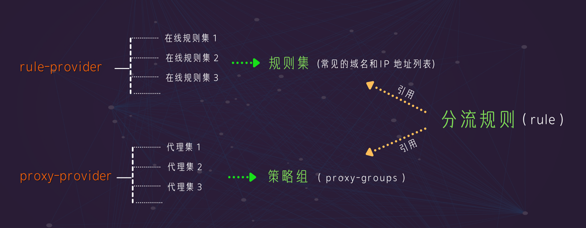

> rule-provider：**俗称规则集合**，通过它，可以引用不同类型的在线规则集 （URL），**clash 就能****自动根据访问目标是否在规则集中，然后匹配到对应的规则，从而选择代理 / 节点或者本地网络进行访问**。简单地说，rule-provider 能让在线的规则集，下载到本地供我们使用。
> 
> proxy-provider：**俗称代理集合**，通过它，可以提取指定 Clash订阅链接或者本地配置文件中的proxies字段中的所有内容。简单地说，proxy-provider 帮助我们提取订阅链接或者配置文件中所包含的节点信息，到当前配置文件中供我们使用。

**特别注意：rule-provider、proxy-provider** 适用于 Clash Premium 内核的规则集（RULE-SET），同时适用于所有使用 Clash Premium 内核的 Clash 图形用户界面（GUI）客户端。

```
太复杂？ [点击观看视频教程](https://youtu.be/IVlnvBQXEgE)
```

##  rule-provider、proxy-provider 大致原理

- proxy-provider：提供节点
- rule-provider：提供规则集，不同的在线规则集，以 url 链接形式提供，包含常见的域名和IP 地址列表，由项目大佬们实时维护的
- proxy-groups：以“策略组”为单位，对 proxy-provider 提供的节点或者手动添加的节点进行分组管理
- rule：引用规则集、策略组，以访问目标是否在规则集中为条件，设定本地网络或者节点对其进行访问

```
比如，RULE-SET,telegramcidr,PROXY

--RULE-SET 是规则集的意思
--telegramcidr 为规则集的名称
--PROXY 为代理策略组名称

意思就是当访问目标是 telegramcidr 中的IP地址时，就通过 PROXY 策略组中的节点去访问。
```



## 示例

#### `proxy-providers` ：

```yaml
# 配置规则参考文档： [https://github.com/Dreamacro/clash/wiki/configuration](https://github.com/Dreamacro/clash/wiki/configuration "Linkify Plus Plus")
# 设置代理提供者 (远程订阅地址 + 本地订阅文件)
proxy-providers:
  foo:
    type: http
    path: ./profiles/proxies/foo.yaml
    url: https://example-url
    interval: 3600
    health-check:
      enable: true
      url: http://[www.gstatic.com/generate_204](http://www.gstatic.com/generate_204 "Linkify Plus Plus")
      interval: 300
  bar:
    type: file
    path: ./profiles/proxies/bar.yaml
    health-check:
      enable: true
      url: http://[www.gstatic.com/generate_204](http://www.gstatic.com/generate_204 "Linkify Plus Plus")
      interval: 300
  
proxy-groups:  
  - name: PROXY
    type: select
    url: [http://www.gstatic.com/generate_204](http://www.gstatic.com/generate_204 "Linkify Plus Plus")
    interval: 3600
    use:
      - foo
      - bar
    proxies:
      - DIRECT
```

**proxy-provider**：俗称代理集合，通过它，可以提取指定 Clash 订阅链接或者本地配置文件中的节点信息，到当前配置文件中供我们使用。

```
简单地说，proxy-provider 帮助我们提取 clash 订阅链接或者配置文件中所包含的节点信息。
```

**HTTP 类型**

- foo 代理集的名称
- type 为该代理集的类型，**简单地说，http 为 clash 订阅链接 ； file 为 本地配置文件**
- path 则是代理集所在的文件路径，“foo” 为保存在本地文件的名字
- 如果 type 为 http， url 则需要填写 clash 订阅链接、设置自动更新的间隔；然后，可以通过 filter 去筛选出链接中包含 “某一个关键词” 的所有节点，比如， 我需要 Blinkload 机场的香港节点， 这里输入 “Hong Kong”, 就能实现。多个关键词用英文输入法下 ”|“连接
- health-check 对代理集所包含的节点，设置自动延迟测试、测试间隔以及目标网站

**File 类型**

- 名称为” bar” 的代理集，类型为 file， 即本地配置文件
- 需要注意的是，需要引用本地配置文件时，文件存放的位置、文件名，一定和 “Path” 这里保持一致。
- 本地配置文件在哪里呢？点击”General“回到 CFW 主页，再点 “Open Folder” 跳转到配置文件所在目录 —-“Profiles”。这个时候，你可以主动把 path 的参数都改为与本地配置文件实际的位置和名字一致；或者新建一个 Proxies 文件夹，再把配置文件拖动这里并重命名为 “ bar”，和默认的 path 设置全部保持一致。

```
" proxy-groups " ，可以由一个或者多个策略组组成，不同的策略组可以引用不同代理集
```

- name 为策略组的名称，因为 PROXY 为默认的策略组，切记，不要去修改这个名称！！不要去修改、不要去修改！！
- type 策略组的类型，建议使用 url-test，这样子，策略组就会自动选用延迟最低的节点 ，规避掉不能正常使用的节点。
- url 是节点延迟测试的目标网站，建议保持默认
- interval 为自动执行 “节点延迟测试” 的间隔
- use 为引用 proxy-provider 的指令，填写对应的代理集名称就可以了，这里的“ foo”、“bar”，就是引用 foo，bar 代理集所包含的节点
- proxies 这里，你可以在这个策略组中的引用单个节点配置；如果使用 openclash 的小伙伴，切记，一定不能删除这里的 “DIRECT”，否则，有可能 openclash 就无法正常下载订阅链接中的配置文件，导致无法使用！

> 此时的 PROXY 策略组，就包含了“ foo和 bar ”代理集中的所有节点，策略组类型为 url-test；当规则使用这个策略组时，就会自动选用延迟最低的节点。

#### Rule Providers 示例

```
Rule Providers 可以看到它是由多个在线规则集组成。
```

> 以 “reject” 规则集为例
> 
> –“reject” 为规则集的名称
> –它的类型是 http
> –规则集类型是 domian 域名
> –url 链接是规则集的在线地址，我们可以打开它，它包含很多域名
> –path 指定了从URL链接下载后的规则集文件的储存路径、文件名称
> –interval 设置自动下载规则集的间隔，86400 秒，即每隔10天会自动下载 URL 包含的规则集文件到本地

```
rule-providers:
  reject:
    type: http
    behavior: domain
    url: "[https://raw.githubusercontent.com/Loyalsoldier/clash-rules/release/reject.txt](https://raw.githubusercontent.com/Loyalsoldier/clash-rules/release/reject.txt "Linkify Plus Plus")"
    path: ./ruleset/reject.yaml
    interval: 86400

  icloud:
    type: http
    behavior: domain
    url: "[https://raw.githubusercontent.com/Loyalsoldier/clash-rules/release/icloud.txt](https://raw.githubusercontent.com/Loyalsoldier/clash-rules/release/icloud.txt "Linkify Plus Plus")"
    path: ./ruleset/icloud.yaml
    interval: 86400

  apple:
    type: http
    behavior: domain
    url: "[https://raw.githubusercontent.com/Loyalsoldier/clash-rules/release/apple.txt](https://raw.githubusercontent.com/Loyalsoldier/clash-rules/release/apple.txt "Linkify Plus Plus")"
    path: ./ruleset/apple.yaml
    interval: 86400

  google:
    type: http
    behavior: domain
    url: "[https://raw.githubusercontent.com/Loyalsoldier/clash-rules/release/google.txt](https://raw.githubusercontent.com/Loyalsoldier/clash-rules/release/google.txt "Linkify Plus Plus")"
    path: ./ruleset/google.yaml
    interval: 86400

  proxy:
    type: http
    behavior: domain
    url: "[https://raw.githubusercontent.com/Loyalsoldier/clash-rules/release/proxy.txt](https://raw.githubusercontent.com/Loyalsoldier/clash-rules/release/proxy.txt "Linkify Plus Plus")"
    path: ./ruleset/proxy.yaml
    interval: 86400

  direct:
    type: http
    behavior: domain
    url: "[https://raw.githubusercontent.com/Loyalsoldier/clash-rules/release/direct.txt](https://raw.githubusercontent.com/Loyalsoldier/clash-rules/release/direct.txt "Linkify Plus Plus")"
    path: ./ruleset/direct.yaml
    interval: 86400

  private:
    type: http
    behavior: domain
    url: "[https://raw.githubusercontent.com/Loyalsoldier/clash-rules/release/private.txt](https://raw.githubusercontent.com/Loyalsoldier/clash-rules/release/private.txt "Linkify Plus Plus")"
    path: ./ruleset/private.yaml
    interval: 86400

  gfw:
    type: http
    behavior: domain
    url: "[https://raw.githubusercontent.com/Loyalsoldier/clash-rules/release/gfw.txt](https://raw.githubusercontent.com/Loyalsoldier/clash-rules/release/gfw.txt "Linkify Plus Plus")"
    path: ./ruleset/gfw.yaml
    interval: 86400

  greatfire:
    type: http
    behavior: domain
    url: "[https://raw.githubusercontent.com/Loyalsoldier/clash-rules/release/greatfire.txt](https://raw.githubusercontent.com/Loyalsoldier/clash-rules/release/greatfire.txt "Linkify Plus Plus")"
    path: ./ruleset/greatfire.yaml
    interval: 86400

  tld-not-cn:
    type: http
    behavior: domain
    url: "[https://raw.githubusercontent.com/Loyalsoldier/clash-rules/release/tld-not-cn.txt](https://raw.githubusercontent.com/Loyalsoldier/clash-rules/release/tld-not-cn.txt "Linkify Plus Plus")"
    path: ./ruleset/tld-not-cn.yaml
    interval: 86400

  telegramcidr:
    type: http
    behavior: ipcidr
    url: "[https://raw.githubusercontent.com/Loyalsoldier/clash-rules/release/telegramcidr.txt](https://raw.githubusercontent.com/Loyalsoldier/clash-rules/release/telegramcidr.txt "Linkify Plus Plus")"
    path: ./ruleset/telegramcidr.yaml
    interval: 86400

  cncidr:
    type: http
    behavior: ipcidr
    url: "[https://raw.githubusercontent.com/Loyalsoldier/clash-rules/release/cncidr.txt](https://raw.githubusercontent.com/Loyalsoldier/clash-rules/release/cncidr.txt "Linkify Plus Plus")"
    path: ./ruleset/cncidr.yaml
    interval: 86400

  lancidr:
    type: http
    behavior: ipcidr
    url: "[https://raw.githubusercontent.com/Loyalsoldier/clash-rules/release/lancidr.txt](https://raw.githubusercontent.com/Loyalsoldier/clash-rules/release/lancidr.txt "Linkify Plus Plus")"
    path: ./ruleset/lancidr.yaml
    interval: 86400
```

#### 白名单模式 Rules 配置方式（推荐）

- 白名单模式，意为「**没有命中规则的网络流量，统统使用代理**」，适用于服务器线路网络质量稳定、快速，不缺服务器流量的用户。
- 以下配置中，除了 `DIRECT` 和 `REJECT` 是默认存在于 Clash 中的 policy（路由策略/流量处理策略），其余均为自定义 policy，对应配置文件中 `proxies` 或 `proxy-groups` 中的 `name`。如你直接使用下面的 `rules` 规则，则需要在 `proxies` 或 `proxy-groups` 中手动配置一个 `name` 为 `PROXY` 的 policy。
- 如你希望 Apple、iCloud 和 Google 列表中的域名使用代理，则把 policy 由 `DIRECT` 改为 `PROXY`，以此类推，举一反三。
- 如你不希望进行 DNS 解析，可在 `GEOIP` 规则的最后加上 `,no-resolve`，如 `GEOIP,CN,DIRECT,no-resolve`。

```yaml
rules:
  - RULE-SET,applications,DIRECT
  - DOMAIN,clash.razord.top,DIRECT
  - DOMAIN,yacd.haishan.me,DIRECT
  - RULE-SET,private,DIRECT
  - RULE-SET,reject,REJECT
  - RULE-SET,icloud,DIRECT
  - RULE-SET,apple,DIRECT
  - RULE-SET,google,DIRECT
  - RULE-SET,proxy,PROXY
  - RULE-SET,direct,DIRECT
  - RULE-SET,lancidr,DIRECT
  - RULE-SET,cncidr,DIRECT
  - RULE-SET,telegramcidr,PROXY
  - GEOIP,LAN,DIRECT
  - GEOIP,CN,DIRECT
  - MATCH,PROXY
```

#### <a id="user-content-黑名单模式-rules-配置方式"></a>[](https://github.com/Loyalsoldier/clash-rules#%E9%BB%91%E5%90%8D%E5%8D%95%E6%A8%A1%E5%BC%8F-rules-%E9%85%8D%E7%BD%AE%E6%96%B9%E5%BC%8F)黑名单模式 Rules 配置方式

- 黑名单模式，意为「**只有命中规则的网络流量，才使用代理**」，适用于服务器线路网络质量不稳定或不够快，或服务器流量紧缺的用户。通常也是软路由用户、家庭网关用户的常用模式。
- 以下配置中，除了 `DIRECT` 和 `REJECT` 是默认存在于 Clash 中的 policy（路由策略/流量处理策略），其余均为自定义 policy，对应配置文件中 `proxies` 或 `proxy-groups` 中的 `name`。如你直接使用下面的 `rules` 规则，则需要在 `proxies` 或 `proxy-groups` 中手动配置一个 `name` 为 `PROXY` 的 policy。

```yaml
rules:
  - RULE-SET,applications,DIRECT
  - DOMAIN,clash.razord.top,DIRECT
  - DOMAIN,yacd.haishan.me,DIRECT
  - RULE-SET,private,DIRECT
  - RULE-SET,reject,REJECT
  - RULE-SET,tld-not-cn,PROXY
  - RULE-SET,gfw,PROXY
  - RULE-SET,greatfire,PROXY
  - RULE-SET,telegramcidr,PROXY
  - MATCH,DIRECT
```

### 配置文件范本基础版（建议新手使用）： [点击跳转（备用）](https://github.com/james20200418/clashx/blob/master/provider_james_GH)

```
mixed-port: 7890
#---------------------------------------------------#
allow-lan: false
mode: Rule
log-level: silent
external-controller: [127.0.0.1:60000](http://127.0.0.1:60000/ "Linkify Plus Plus")

# 节点配置文件统一存放在 ./profiles/proxies/ 目录中

proxy-providers:
# 从链接导入的配置文件（支持多个 Clash 订阅链接）
 foo:
   type: http
   path: ./profiles/proxies/foo.yaml
   url: https://example-url (clash 订阅链接)
   interval: 3600 
   health-check:
     enable: true
     url: [http://www.gstatic.com/generate_204](http://www.gstatic.com/generate_204 "Linkify Plus Plus")
     interval: 300

proxy-groups:
- name: PROXY
  type: url-test
  url: [http://www.gstatic.com/generate_204](http://www.gstatic.com/generate_204 "Linkify Plus Plus")
  interval: 3600
  use: # 引入 proxy-provider 使用 use 关键字
   - foo

# clash-rules 项目提供的规则集
rule-providers:
  reject:
    type: http
    behavior: domain
    url: "[https://cdn.jsdelivr.net/gh/Loyalsoldier/clash-rules@release/reject.txt](https://cdn.jsdelivr.net/gh/Loyalsoldier/clash-rules@release/reject.txt "Linkify Plus Plus")"
    path: ./profiles/rules/reject.yaml
    interval: 86400
  icloud:
    type: http
    behavior: domain
    url: "[https://cdn.jsdelivr.net/gh/Loyalsoldier/clash-rules@release/icloud.txt](https://cdn.jsdelivr.net/gh/Loyalsoldier/clash-rules@release/icloud.txt "Linkify Plus Plus")"
    path: ./profiles/rules/icloud.yaml
    interval: 86400
  apple:
    type: http
    behavior: domain
    url: "[https://cdn.jsdelivr.net/gh/Loyalsoldier/clash-rules@release/apple.txt](https://cdn.jsdelivr.net/gh/Loyalsoldier/clash-rules@release/apple.txt "Linkify Plus Plus")"
    path: ./profiles/rules/apple.yaml
    interval: 86400
  google:
    type: http
    behavior: domain
    url: "[https://cdn.jsdelivr.net/gh/Loyalsoldier/clash-rules@release/google.txt](https://cdn.jsdelivr.net/gh/Loyalsoldier/clash-rules@release/google.txt "Linkify Plus Plus")"
    path: ./profiles/rules/google.yaml
    interval: 86400
  proxy:
    type: http
    behavior: domain
    url: "[https://cdn.jsdelivr.net/gh/Loyalsoldier/clash-rules@release/proxy.txt](https://cdn.jsdelivr.net/gh/Loyalsoldier/clash-rules@release/proxy.txt "Linkify Plus Plus")"
    path: ./profiles/rules/proxy.yaml
    interval: 86400
  direct:
    type: http
    behavior: domain
    url: "[https://cdn.jsdelivr.net/gh/Loyalsoldier/clash-rules@release/direct.txt](https://cdn.jsdelivr.net/gh/Loyalsoldier/clash-rules@release/direct.txt "Linkify Plus Plus")"
    path: ./profiles/rules/direct.yaml
    interval: 86400
  private:
    type: http
    behavior: domain
    url: "[https://cdn.jsdelivr.net/gh/Loyalsoldier/clash-rules@release/private.txt](https://cdn.jsdelivr.net/gh/Loyalsoldier/clash-rules@release/private.txt "Linkify Plus Plus")"
    path: ./profiles/rules/private.yaml
    interval: 86400
  gfw:
    type: http
    behavior: domain
    url: "[https://cdn.jsdelivr.net/gh/Loyalsoldier/clash-rules@release/gfw.txt](https://cdn.jsdelivr.net/gh/Loyalsoldier/clash-rules@release/gfw.txt "Linkify Plus Plus")"
    path: ./profiles/rules/gfw.yaml
    interval: 86400
  greatfire:
    type: http
    behavior: domain
    url: "[https://cdn.jsdelivr.net/gh/Loyalsoldier/clash-rules@release/greatfire.txt](https://cdn.jsdelivr.net/gh/Loyalsoldier/clash-rules@release/greatfire.txt "Linkify Plus Plus")"
    path: ./profiles/rules/greatfire.yaml
    interval: 86400
  tld-not-cn:
    type: http
    behavior: domain
    url: "[https://cdn.jsdelivr.net/gh/Loyalsoldier/clash-rules@release/tld-not-cn.txt](https://cdn.jsdelivr.net/gh/Loyalsoldier/clash-rules@release/tld-not-cn.txt "Linkify Plus Plus")"
    path: ./profiles/rules/tld-not-cn.yaml
    interval: 86400
  telegramcidr:
    type: http
    behavior: ipcidr
    url: "[https://cdn.jsdelivr.net/gh/Loyalsoldier/clash-rules@release/telegramcidr.txt](https://cdn.jsdelivr.net/gh/Loyalsoldier/clash-rules@release/telegramcidr.txt "Linkify Plus Plus")"
    path: ./profiles/rules/telegramcidr.yaml
    interval: 86400
  cncidr:
    type: http
    behavior: ipcidr
    url: "[https://cdn.jsdelivr.net/gh/Loyalsoldier/clash-rules@release/cncidr.txt](https://cdn.jsdelivr.net/gh/Loyalsoldier/clash-rules@release/cncidr.txt "Linkify Plus Plus")"
    path: ./profiles/rules/cncidr.yaml
    interval: 86400
  lancidr:
    type: http
    behavior: ipcidr
    url: "[https://cdn.jsdelivr.net/gh/Loyalsoldier/clash-rules@release/lancidr.txt](https://cdn.jsdelivr.net/gh/Loyalsoldier/clash-rules@release/lancidr.txt "Linkify Plus Plus")"
    path: ./profiles/rules/lancidr.yaml
    interval: 86400 # 分流规则 rules:
  - PROCESS-NAME,v2ray,DIRECT
  - PROCESS-NAME,xray,DIRECT
  - PROCESS-NAME,naive,DIRECT
  - PROCESS-NAME,trojan,DIRECT
  - PROCESS-NAME,trojan-go,DIRECT
  - PROCESS-NAME,ss-local,DIRECT
  - PROCESS-NAME,privoxy,DIRECT
  - PROCESS-NAME,leaf,DIRECT
  - PROCESS-NAME,v2ray.exe,DIRECT
  - PROCESS-NAME,xray.exe,DIRECT
  - PROCESS-NAME,naive.exe,DIRECT
  - PROCESS-NAME,trojan.exe,DIRECT
  - PROCESS-NAME,trojan-go.exe,DIRECT
  - PROCESS-NAME,ss-local.exe,DIRECT
  - PROCESS-NAME,privoxy.exe,DIRECT
  - PROCESS-NAME,leaf.exe,DIRECT
  - PROCESS-NAME,Surge,DIRECT
  - PROCESS-NAME,Surge 2,DIRECT
  - PROCESS-NAME,Surge 3,DIRECT
  - PROCESS-NAME,Surge 4,DIRECT
  - PROCESS-NAME,Surge%202,DIRECT
  - PROCESS-NAME,Surge%203,DIRECT
  - PROCESS-NAME,Surge%204,DIRECT
  - PROCESS-NAME,Thunder,DIRECT
  - PROCESS-NAME,DownloadService,DIRECT
  - PROCESS-NAME,qBittorrent,DIRECT
  - PROCESS-NAME,Transmission,DIRECT
  - PROCESS-NAME,fdm,DIRECT
  - PROCESS-NAME,aria2c,DIRECT
  - PROCESS-NAME,Folx,DIRECT
  - PROCESS-NAME,NetTransport,DIRECT
  - PROCESS-NAME,uTorrent,DIRECT
  - PROCESS-NAME,WebTorrent,DIRECT
  - PROCESS-NAME,aria2c.exe,DIRECT
  - PROCESS-NAME,BitComet.exe,DIRECT
  - PROCESS-NAME,fdm.exe,DIRECT
  - PROCESS-NAME,NetTransport.exe,DIRECT
  - PROCESS-NAME,qbittorrent.exe,DIRECT
  - PROCESS-NAME,Thunder.exe,DIRECT
  - PROCESS-NAME,ThunderVIP.exe,DIRECT
  - PROCESS-NAME,transmission-daemon.exe,DIRECT
  - PROCESS-NAME,transmission-qt.exe,DIRECT
  - PROCESS-NAME,uTorrent.exe,DIRECT
  - PROCESS-NAME,WebTorrent.exe,DIRECT
  - DOMAIN,[clash.razord.top](http://clash.razord.top/ "Linkify Plus Plus"),DIRECT
  - DOMAIN,[yacd.haishan.me](http://yacd.haishan.me/ "Linkify Plus Plus"),DIRECT
  - RULE-SET,private,DIRECT
  - RULE-SET,reject,REJECT
  - RULE-SET,icloud,DIRECT
  - RULE-SET,apple,DIRECT
  - RULE-SET,google,DIRECT
  - RULE-SET,proxy,PROXY
  - RULE-SET,direct,DIRECT
  - RULE-SET,telegramcidr,PROXY
  - GEOIP,LAN,DIRECT
  - GEOIP,CN,DIRECT
  - MATCH,PROXY
```

### 配置文件范本进阶版（白名单）： [点击跳转（备用）](https://gist.github.com/james20200418/ad183b0f21c29df12f7021aafe6a0a0a)

```
mixed-port: 7890
#---------------------------------------------------#
allow-lan: false
mode: Rule
log-level: silent
external-controller: [127.0.0.1:60000](http://127.0.0.1:60000/ "Linkify Plus Plus")

# 节点配置文件统一存放在 ./profiles/proxies/ 目录中

proxy-providers:
# 从链接导入的配置文件（支持多个 Clash 订阅链接）
 foo:
   type: http
   path: ./profiles/proxies/foo.yaml
   url: https://example-url (clash 订阅链接)
   interval: 3600 
   filter: 'Hong Kong' # 删选出含有该关键词的节点
   health-check:
     enable: true
     url: [http://www.gstatic.com/generate_204](http://www.gstatic.com/generate_204 "Linkify Plus Plus")
     interval: 300 
 # 从本地导入的 clash 配置文件
 bar:
   type: file
   path: ./profiles/proxies/bar.yaml
   health-check:
     enable: true
     url: [http://www.gstatic.com/generate_204](http://www.gstatic.com/generate_204 "Linkify Plus Plus")
     interval: 600

proxy-groups:
- name: PROXY
  type: url-test
  url: [http://www.gstatic.com/generate_204](http://www.gstatic.com/generate_204 "Linkify Plus Plus")
  interval: 3600
  use: # 引入 proxy-provider 使用 use 关键字
   - foo
   - bar
  proxies:
   - DIRECT

# clash-rules 项目提供的规则集
rule-providers:
  reject:
    type: http
    behavior: domain
    url: "[https://cdn.jsdelivr.net/gh/Loyalsoldier/clash-rules@release/reject.txt](https://cdn.jsdelivr.net/gh/Loyalsoldier/clash-rules@release/reject.txt "Linkify Plus Plus")"
    path: ./profiles/rules/reject.yaml
    interval: 86400
  icloud:
    type: http
    behavior: domain
    url: "[https://cdn.jsdelivr.net/gh/Loyalsoldier/clash-rules@release/icloud.txt](https://cdn.jsdelivr.net/gh/Loyalsoldier/clash-rules@release/icloud.txt "Linkify Plus Plus")"
    path: ./profiles/rules/icloud.yaml
    interval: 86400
  apple:
    type: http
    behavior: domain
    url: "[https://cdn.jsdelivr.net/gh/Loyalsoldier/clash-rules@release/apple.txt](https://cdn.jsdelivr.net/gh/Loyalsoldier/clash-rules@release/apple.txt "Linkify Plus Plus")"
    path: ./profiles/rules/apple.yaml
    interval: 86400
  google:
    type: http
    behavior: domain
    url: "[https://cdn.jsdelivr.net/gh/Loyalsoldier/clash-rules@release/google.txt](https://cdn.jsdelivr.net/gh/Loyalsoldier/clash-rules@release/google.txt "Linkify Plus Plus")"
    path: ./profiles/rules/google.yaml
    interval: 86400
  proxy:
    type: http
    behavior: domain
    url: "[https://cdn.jsdelivr.net/gh/Loyalsoldier/clash-rules@release/proxy.txt](https://cdn.jsdelivr.net/gh/Loyalsoldier/clash-rules@release/proxy.txt "Linkify Plus Plus")"
    path: ./profiles/rules/proxy.yaml
    interval: 86400
  direct:
    type: http
    behavior: domain
    url: "[https://cdn.jsdelivr.net/gh/Loyalsoldier/clash-rules@release/direct.txt](https://cdn.jsdelivr.net/gh/Loyalsoldier/clash-rules@release/direct.txt "Linkify Plus Plus")"
    path: ./profiles/rules/direct.yaml
    interval: 86400
  private:
    type: http
    behavior: domain
    url: "[https://cdn.jsdelivr.net/gh/Loyalsoldier/clash-rules@release/private.txt](https://cdn.jsdelivr.net/gh/Loyalsoldier/clash-rules@release/private.txt "Linkify Plus Plus")"
    path: ./profiles/rules/private.yaml
    interval: 86400
  gfw:
    type: http
    behavior: domain
    url: "[https://cdn.jsdelivr.net/gh/Loyalsoldier/clash-rules@release/gfw.txt](https://cdn.jsdelivr.net/gh/Loyalsoldier/clash-rules@release/gfw.txt "Linkify Plus Plus")"
    path: ./profiles/rules/gfw.yaml
    interval: 86400
  greatfire:
    type: http
    behavior: domain
    url: "[https://cdn.jsdelivr.net/gh/Loyalsoldier/clash-rules@release/greatfire.txt](https://cdn.jsdelivr.net/gh/Loyalsoldier/clash-rules@release/greatfire.txt "Linkify Plus Plus")"
    path: ./profiles/rules/greatfire.yaml
    interval: 86400
  tld-not-cn:
    type: http
    behavior: domain
    url: "[https://cdn.jsdelivr.net/gh/Loyalsoldier/clash-rules@release/tld-not-cn.txt](https://cdn.jsdelivr.net/gh/Loyalsoldier/clash-rules@release/tld-not-cn.txt "Linkify Plus Plus")"
    path: ./profiles/rules/tld-not-cn.yaml
    interval: 86400
  telegramcidr:
    type: http
    behavior: ipcidr
    url: "[https://cdn.jsdelivr.net/gh/Loyalsoldier/clash-rules@release/telegramcidr.txt](https://cdn.jsdelivr.net/gh/Loyalsoldier/clash-rules@release/telegramcidr.txt "Linkify Plus Plus")"
    path: ./profiles/rules/telegramcidr.yaml
    interval: 86400
  cncidr:
    type: http
    behavior: ipcidr
    url: "[https://cdn.jsdelivr.net/gh/Loyalsoldier/clash-rules@release/cncidr.txt](https://cdn.jsdelivr.net/gh/Loyalsoldier/clash-rules@release/cncidr.txt "Linkify Plus Plus")"
    path: ./profiles/rules/cncidr.yaml
    interval: 86400
  lancidr:
    type: http
    behavior: ipcidr
    url: "[https://cdn.jsdelivr.net/gh/Loyalsoldier/clash-rules@release/lancidr.txt](https://cdn.jsdelivr.net/gh/Loyalsoldier/clash-rules@release/lancidr.txt "Linkify Plus Plus")"
    path: ./profiles/rules/lancidr.yaml
    interval: 86400 # 分流规则 rules:
  - PROCESS-NAME,v2ray,DIRECT
  - PROCESS-NAME,xray,DIRECT
  - PROCESS-NAME,naive,DIRECT
  - PROCESS-NAME,trojan,DIRECT
  - PROCESS-NAME,trojan-go,DIRECT
  - PROCESS-NAME,ss-local,DIRECT
  - PROCESS-NAME,privoxy,DIRECT
  - PROCESS-NAME,leaf,DIRECT
  - PROCESS-NAME,v2ray.exe,DIRECT
  - PROCESS-NAME,xray.exe,DIRECT
  - PROCESS-NAME,naive.exe,DIRECT
  - PROCESS-NAME,trojan.exe,DIRECT
  - PROCESS-NAME,trojan-go.exe,DIRECT
  - PROCESS-NAME,ss-local.exe,DIRECT
  - PROCESS-NAME,privoxy.exe,DIRECT
  - PROCESS-NAME,leaf.exe,DIRECT
  - PROCESS-NAME,Surge,DIRECT
  - PROCESS-NAME,Surge 2,DIRECT
  - PROCESS-NAME,Surge 3,DIRECT
  - PROCESS-NAME,Surge 4,DIRECT
  - PROCESS-NAME,Surge%202,DIRECT
  - PROCESS-NAME,Surge%203,DIRECT
  - PROCESS-NAME,Surge%204,DIRECT
  - PROCESS-NAME,Thunder,DIRECT
  - PROCESS-NAME,DownloadService,DIRECT
  - PROCESS-NAME,qBittorrent,DIRECT
  - PROCESS-NAME,Transmission,DIRECT
  - PROCESS-NAME,fdm,DIRECT
  - PROCESS-NAME,aria2c,DIRECT
  - PROCESS-NAME,Folx,DIRECT
  - PROCESS-NAME,NetTransport,DIRECT
  - PROCESS-NAME,uTorrent,DIRECT
  - PROCESS-NAME,WebTorrent,DIRECT
  - PROCESS-NAME,aria2c.exe,DIRECT
  - PROCESS-NAME,BitComet.exe,DIRECT
  - PROCESS-NAME,fdm.exe,DIRECT
  - PROCESS-NAME,NetTransport.exe,DIRECT
  - PROCESS-NAME,qbittorrent.exe,DIRECT
  - PROCESS-NAME,Thunder.exe,DIRECT
  - PROCESS-NAME,ThunderVIP.exe,DIRECT
  - PROCESS-NAME,transmission-daemon.exe,DIRECT
  - PROCESS-NAME,transmission-qt.exe,DIRECT
  - PROCESS-NAME,uTorrent.exe,DIRECT
  - PROCESS-NAME,WebTorrent.exe,DIRECT
  - DOMAIN,[clash.razord.top](http://clash.razord.top/ "Linkify Plus Plus"),DIRECT
  - DOMAIN,[yacd.haishan.me](http://yacd.haishan.me/ "Linkify Plus Plus"),DIRECT
  - RULE-SET,private,DIRECT
  - RULE-SET,reject,REJECT
  - RULE-SET,icloud,DIRECT
  - RULE-SET,apple,DIRECT
  - RULE-SET,google,DIRECT
  - RULE-SET,proxy,PROXY
  - RULE-SET,direct,DIRECT
  - RULE-SET,telegramcidr,PROXY
  - GEOIP,LAN,DIRECT
  - GEOIP,CN,DIRECT
  - MATCH,PROXY
```

### 自用的配置文件进阶版（白名单模式+YouTube+Netflix 分流规则）：[点击跳转（备用）](https://github.com/james20200418/clashx/blob/master/provider_james)

```yaml
mixed-port: 7890
allow-lan: false
mode: Rule
log-level: silent
external-controller: [127.0.0.1:60000](http://127.0.0.1:60000/ "Linkify Plus Plus")

`proxy-providers:
  BL:
    type: http
    path: ./profiles/proxies/BL.yaml
    url: "https://"
    interval: 3600
    filter: 'Hong Kong'
    health-check:
      enable: true
      url: http://[www.gstatic.com/generate_204](http://www.gstatic.com/generate_204 "Linkify Plus Plus")
      interval: 300
  KY:
    type: http
    path: ./profiles/proxies/KY.yaml
    url: "https://"
    interval: 3600
    filter: 'IEPL - 香港'
    health-check:
      enable: true
      url: http://[www.gstatic.com/generate_204](http://www.gstatic.com/generate_204 "Linkify Plus Plus")
      interval: 300
  BLSG:
    type: http
    path: ./profiles/proxies/BLSG.yaml
    url: "https://"
    interval: 3600
    filter: 'Singapore'
    health-check:
      enable: true
      url: http://[www.gstatic.com/generate_204](http://www.gstatic.com/generate_204 "Linkify Plus Plus")
      interval: 300`  `proxy-groups:
  - name: PROXY
    type: url-test
    url: [http://www.gstatic.com/generate_204](http://www.gstatic.com/generate_204 "Linkify Plus Plus")
    interval: 300
    use:
      - BL
      - KY
    proxies:
      - DIRECT
  - name: Netflix
    type: url-test
    url: [http://www.gstatic.com/generate_204](http://www.gstatic.com/generate_204 "Linkify Plus Plus")
    interval: 300
    use:
      - BLSG
  - name: Youtube
    type: url-test
    url: [http://www.gstatic.com/generate_204](http://www.gstatic.com/generate_204 "Linkify Plus Plus")
    interval: 300
    use:
      - KY 
rule-providers:
  reject:
    type: http
    behavior: domain
    url: "[https://cdn.jsdelivr.net/gh/Loyalsoldier/clash-rules@release/reject.txt](https://cdn.jsdelivr.net/gh/Loyalsoldier/clash-rules@release/reject.txt "Linkify Plus Plus")"
    path: ./ruleset/reject.yaml
    interval: 86400
  icloud:
    type: http
    behavior: domain
    url: "[https://cdn.jsdelivr.net/gh/Loyalsoldier/clash-rules@release/icloud.txt](https://cdn.jsdelivr.net/gh/Loyalsoldier/clash-rules@release/icloud.txt "Linkify Plus Plus")"
    path: ./ruleset/icloud.yaml
    interval: 86400
  apple:
    type: http
    behavior: domain
    url: "[https://cdn.jsdelivr.net/gh/Loyalsoldier/clash-rules@release/apple.txt](https://cdn.jsdelivr.net/gh/Loyalsoldier/clash-rules@release/apple.txt "Linkify Plus Plus")"
    path: ./ruleset/apple.yaml
    interval: 86400
  google:
    type: http
    behavior: domain
    url: "[https://cdn.jsdelivr.net/gh/Loyalsoldier/clash-rules@release/google.txt](https://cdn.jsdelivr.net/gh/Loyalsoldier/clash-rules@release/google.txt "Linkify Plus Plus")"
    path: ./ruleset/google.yaml
    interval: 86400
  proxy:
    type: http
    behavior: domain
    url: "[https://cdn.jsdelivr.net/gh/Loyalsoldier/clash-rules@release/proxy.txt](https://cdn.jsdelivr.net/gh/Loyalsoldier/clash-rules@release/proxy.txt "Linkify Plus Plus")"
    path: ./ruleset/proxy.yaml
    interval: 86400
  direct:
    type: http
    behavior: domain
    url: "[https://cdn.jsdelivr.net/gh/Loyalsoldier/clash-rules@release/direct.txt](https://cdn.jsdelivr.net/gh/Loyalsoldier/clash-rules@release/direct.txt "Linkify Plus Plus")"
    path: ./ruleset/direct.yaml
    interval: 86400
  private:
    type: http
    behavior: domain
    url: "[https://cdn.jsdelivr.net/gh/Loyalsoldier/clash-rules@release/private.txt](https://cdn.jsdelivr.net/gh/Loyalsoldier/clash-rules@release/private.txt "Linkify Plus Plus")"
    path: ./ruleset/private.yaml
    interval: 86400
  gfw:
    type: http
    behavior: domain
    url: "[https://cdn.jsdelivr.net/gh/Loyalsoldier/clash-rules@release/gfw.txt](https://cdn.jsdelivr.net/gh/Loyalsoldier/clash-rules@release/gfw.txt "Linkify Plus Plus")"
    path: ./ruleset/gfw.yaml
    interval: 86400
  greatfire:
    type: http
    behavior: domain
    url: "[https://cdn.jsdelivr.net/gh/Loyalsoldier/clash-rules@release/greatfire.txt](https://cdn.jsdelivr.net/gh/Loyalsoldier/clash-rules@release/greatfire.txt "Linkify Plus Plus")"
    path: ./ruleset/greatfire.yaml
    interval: 86400
  tld-not-cn:
    type: http
    behavior: domain
    url: "[https://cdn.jsdelivr.net/gh/Loyalsoldier/clash-rules@release/tld-not-cn.txt](https://cdn.jsdelivr.net/gh/Loyalsoldier/clash-rules@release/tld-not-cn.txt "Linkify Plus Plus")"
    path: ./ruleset/tld-not-cn.yaml
    interval: 86400
  telegramcidr:
    type: http
    behavior: ipcidr
    url: "[https://cdn.jsdelivr.net/gh/Loyalsoldier/clash-rules@release/telegramcidr.txt](https://cdn.jsdelivr.net/gh/Loyalsoldier/clash-rules@release/telegramcidr.txt "Linkify Plus Plus")"
    path: ./ruleset/telegramcidr.yaml
    interval: 86400
  cncidr:
    type: http
    behavior: ipcidr
    url: "[https://cdn.jsdelivr.net/gh/Loyalsoldier/clash-rules@release/cncidr.txt](https://cdn.jsdelivr.net/gh/Loyalsoldier/clash-rules@release/cncidr.txt "Linkify Plus Plus")"
    path: ./ruleset/cncidr.yaml
    interval: 86400
  lancidr:
     type: http
     behavior: ipcidr
     url: "[https://cdn.jsdelivr.net/gh/Loyalsoldier/clash-rules@release/lancidr.txt](https://cdn.jsdelivr.net/gh/Loyalsoldier/clash-rules@release/lancidr.txt "Linkify Plus Plus")"
     path: ./ruleset/lancidr.yaml
     interval: 86400`  

 `rules:
  - DOMAIN-KEYWORD,youtube,Youtube
  - DOMAIN,[youtubei.googleapis.com](http://youtubei.googleapis.com/ "Linkify Plus Plus"),Youtube
  - DOMAIN,[yt3.ggpht.com](http://yt3.ggpht.com/ "Linkify Plus Plus"),Youtube
  - DOMAIN-SUFFIX,[googlevideo.com](http://googlevideo.com/ "Linkify Plus Plus"),Youtube
  - DOMAIN-SUFFIX,[gvt2.com](http://gvt2.com/ "Linkify Plus Plus"),Youtube
  - DOMAIN-SUFFIX,[withyoutube.com](http://withyoutube.com/ "Linkify Plus Plus"),Youtube
  - DOMAIN-SUFFIX,[youtu.be](http://youtu.be/ "Linkify Plus Plus"),Youtube
  - DOMAIN-SUFFIX,[youtube-nocookie.com](http://youtube-nocookie.com/ "Linkify Plus Plus"),Youtube
  - DOMAIN-SUFFIX,[youtube.com](http://youtube.com/ "Linkify Plus Plus"),Youtube
  - DOMAIN-SUFFIX,[youtubeeducation.com](http://youtubeeducation.com/ "Linkify Plus Plus"),Youtube
  - DOMAIN-SUFFIX,[youtubegaming.com](http://youtubegaming.com/ "Linkify Plus Plus"),Youtube
  - DOMAIN-SUFFIX,[youtubekids.com](http://youtubekids.com/ "Linkify Plus Plus"),Youtube
  - DOMAIN-SUFFIX,[yt.be](http://yt.be/ "Linkify Plus Plus"),Youtube
  - DOMAIN-SUFFIX,[ytimg.com](http://ytimg.com/ "Linkify Plus Plus"),Youtube
  - DOMAIN-KEYWORD,netflixdnstest,Netflix
  - DOMAIN,[netflix.com.edgesuite.net](http://netflix.com.edgesuite.net/ "Linkify Plus Plus"),Netflix
  - DOMAIN-SUFFIX,[fast.com](http://fast.com/ "Linkify Plus Plus"),Netflix
  - DOMAIN-SUFFIX,[netflix.com](http://netflix.com/ "Linkify Plus Plus"),Netflix
  - DOMAIN-SUFFIX,[netflix.net](http://netflix.net/ "Linkify Plus Plus"),Netflix
  - DOMAIN-SUFFIX,[netflixdnstest0.com](http://netflixdnstest0.com/ "Linkify Plus Plus"),Netflix
  - DOMAIN-SUFFIX,[netflixdnstest1.com](http://netflixdnstest1.com/ "Linkify Plus Plus"),Netflix
  - DOMAIN-SUFFIX,[netflixdnstest2.com](http://netflixdnstest2.com/ "Linkify Plus Plus"),Netflix
  - DOMAIN-SUFFIX,[netflixdnstest3.com](http://netflixdnstest3.com/ "Linkify Plus Plus"),Netflix
  - DOMAIN-SUFFIX,[netflixdnstest4.com](http://netflixdnstest4.com/ "Linkify Plus Plus"),Netflix
  - DOMAIN-SUFFIX,[netflixdnstest5.com](http://netflixdnstest5.com/ "Linkify Plus Plus"),Netflix
  - DOMAIN-SUFFIX,[netflixdnstest6.com](http://netflixdnstest6.com/ "Linkify Plus Plus"),Netflix
  - DOMAIN-SUFFIX,[netflixdnstest7.com](http://netflixdnstest7.com/ "Linkify Plus Plus"),Netflix
  - DOMAIN-SUFFIX,[netflixdnstest8.com](http://netflixdnstest8.com/ "Linkify Plus Plus"),Netflix
  - DOMAIN-SUFFIX,[netflixdnstest9.com](http://netflixdnstest9.com/ "Linkify Plus Plus"),Netflix
  - DOMAIN-SUFFIX,[nflxext.com](http://nflxext.com/ "Linkify Plus Plus"),Netflix
  - DOMAIN-SUFFIX,[nflximg.com](http://nflximg.com/ "Linkify Plus Plus"),Netflix
  - DOMAIN-SUFFIX,[nflximg.net](http://nflximg.net/ "Linkify Plus Plus"),Netflix
  - DOMAIN-SUFFIX,[nflxso.net](http://nflxso.net/ "Linkify Plus Plus"),Netflix
  - DOMAIN-SUFFIX,[nflxvideo.net](http://nflxvideo.net/ "Linkify Plus Plus"),Netflix
  - IP-CIDR,[8.41.4.0/24,Netflix,no-resolve](http://8.41.4.0/24,Netflix,no-resolve "Linkify Plus Plus")
  - IP-CIDR,[23.246.0.0/18,Netflix,no-resolve](http://23.246.0.0/18,Netflix,no-resolve "Linkify Plus Plus")
  - IP-CIDR,[37.77.184.0/21,Netflix,no-resolve](http://37.77.184.0/21,Netflix,no-resolve "Linkify Plus Plus")
  - IP-CIDR,[38.72.126.0/24,Netflix,no-resolve](http://38.72.126.0/24,Netflix,no-resolve "Linkify Plus Plus")
  - IP-CIDR,[45.57.0.0/17,Netflix,no-resolve](http://45.57.0.0/17,Netflix,no-resolve "Linkify Plus Plus")
  - IP-CIDR,[64.120.128.0/17,Netflix,no-resolve](http://64.120.128.0/17,Netflix,no-resolve "Linkify Plus Plus")
  - IP-CIDR,[66.197.128.0/17,Netflix,no-resolve](http://66.197.128.0/17,Netflix,no-resolve "Linkify Plus Plus")
  - IP-CIDR,[69.53.224.0/19,Netflix,no-resolve](http://69.53.224.0/19,Netflix,no-resolve "Linkify Plus Plus")
  - IP-CIDR,[103.87.204.0/22,Netflix,no-resolve](http://103.87.204.0/22,Netflix,no-resolve "Linkify Plus Plus")
  - IP-CIDR,[108.175.32.0/20,Netflix,no-resolve](http://108.175.32.0/20,Netflix,no-resolve "Linkify Plus Plus")
  - IP-CIDR,[185.2.220.0/22,Netflix,no-resolve](http://185.2.220.0/22,Netflix,no-resolve "Linkify Plus Plus")
  - IP-CIDR,[185.9.188.0/22,Netflix,no-resolve](http://185.9.188.0/22,Netflix,no-resolve "Linkify Plus Plus")
  - IP-CIDR,[192.173.64.0/18,Netflix,no-resolve](http://192.173.64.0/18,Netflix,no-resolve "Linkify Plus Plus")
  - IP-CIDR,[198.38.96.0/19,Netflix,no-resolve](http://198.38.96.0/19,Netflix,no-resolve "Linkify Plus Plus")
  - IP-CIDR,[198.45.48.0/20,Netflix,no-resolve](http://198.45.48.0/20,Netflix,no-resolve "Linkify Plus Plus")
  - IP-CIDR,[207.45.72.0/22,Netflix,no-resolve](http://207.45.72.0/22,Netflix,no-resolve "Linkify Plus Plus")
  - IP-CIDR,[208.75.76.0/22,Netflix,no-resolve](http://208.75.76.0/22,Netflix,no-resolve "Linkify Plus Plus")
  - PROCESS-NAME,v2ray,DIRECT
  - PROCESS-NAME,xray,DIRECT
  - PROCESS-NAME,naive,DIRECT
  - PROCESS-NAME,trojan,DIRECT
  - PROCESS-NAME,trojan-go,DIRECT
  - PROCESS-NAME,ss-local,DIRECT
  - PROCESS-NAME,privoxy,DIRECT
  - PROCESS-NAME,leaf,DIRECT
  - PROCESS-NAME,v2ray.exe,DIRECT
  - PROCESS-NAME,xray.exe,DIRECT
  - PROCESS-NAME,naive.exe,DIRECT
  - PROCESS-NAME,trojan.exe,DIRECT
  - PROCESS-NAME,trojan-go.exe,DIRECT
  - PROCESS-NAME,ss-local.exe,DIRECT
  - PROCESS-NAME,privoxy.exe,DIRECT
  - PROCESS-NAME,leaf.exe,DIRECT
  - PROCESS-NAME,Surge,DIRECT
  - PROCESS-NAME,Surge 2,DIRECT
  - PROCESS-NAME,Surge 3,DIRECT
  - PROCESS-NAME,Surge 4,DIRECT
  - PROCESS-NAME,Surge%202,DIRECT
  - PROCESS-NAME,Surge%203,DIRECT
  - PROCESS-NAME,Surge%204,DIRECT
  - PROCESS-NAME,Thunder,DIRECT
  - PROCESS-NAME,DownloadService,DIRECT
  - PROCESS-NAME,qBittorrent,DIRECT
  - PROCESS-NAME,Transmission,DIRECT
  - PROCESS-NAME,fdm,DIRECT
  - PROCESS-NAME,aria2c,DIRECT
  - PROCESS-NAME,Folx,DIRECT
  - PROCESS-NAME,NetTransport,DIRECT
  - PROCESS-NAME,uTorrent,DIRECT
  - PROCESS-NAME,WebTorrent,DIRECT
  - PROCESS-NAME,aria2c.exe,DIRECT
  - PROCESS-NAME,BitComet.exe,DIRECT
  - PROCESS-NAME,fdm.exe,DIRECT
  - PROCESS-NAME,NetTransport.exe,DIRECT
  - PROCESS-NAME,qbittorrent.exe,DIRECT
  - PROCESS-NAME,Thunder.exe,DIRECT
  - PROCESS-NAME,ThunderVIP.exe,DIRECT
  - PROCESS-NAME,transmission-daemon.exe,DIRECT
  - PROCESS-NAME,transmission-qt.exe,DIRECT
  - PROCESS-NAME,uTorrent.exe,DIRECT
  - PROCESS-NAME,WebTorrent.exe,DIRECT
  - DOMAIN,[clash.razord.top](http://clash.razord.top/ "Linkify Plus Plus"),DIRECT
  - DOMAIN,[yacd.haishan.me](http://yacd.haishan.me/ "Linkify Plus Plus"),DIRECT
  - RULE-SET,private,DIRECT
  - RULE-SET,reject,REJECT
  - RULE-SET,icloud,DIRECT
  - RULE-SET,apple,DIRECT
  - RULE-SET,google,DIRECT
  - RULE-SET,proxy,PROXY
  - RULE-SET,direct,DIRECT
  - RULE-SET,telegramcidr,PROXY
  - GEOIP,LAN,DIRECT
  - GEOIP,CN,DIRECT
  - MATCH,PROXY`
```

参考资料（不分先后顺序）：感谢各位大佬的无私分享

[科学上网工具 \- 免费的 Clash 代理工具使用、配置及需要避免的坑经验总结 – 小 V 爱折腾 (vlike.work)](https://vlike.work/tech/how-to-clash.html)

[https://github.com/Loyalsoldier/clash-rules](https://github.com/Loyalsoldier/clash-rules "Linkify Plus Plus")

[https://gist.github.com/ricky9w/31fffc1b6eadadba2603f323dc92bebf](https://gist.github.com/ricky9w/31fffc1b6eadadba2603f323dc92bebf "Linkify Plus Plus")

[https://github.com/Dreamacro/clash/wiki/configuration#proxy-groups](https://github.com/Dreamacro/clash/wiki/configuration#proxy-groups "Linkify Plus Plus")